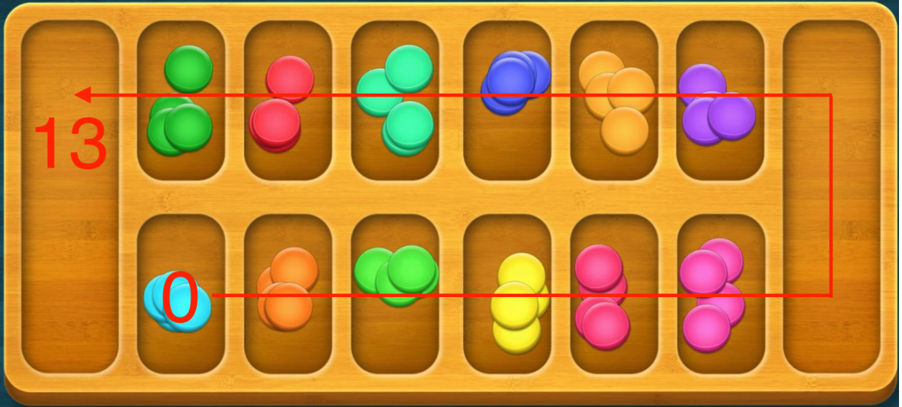
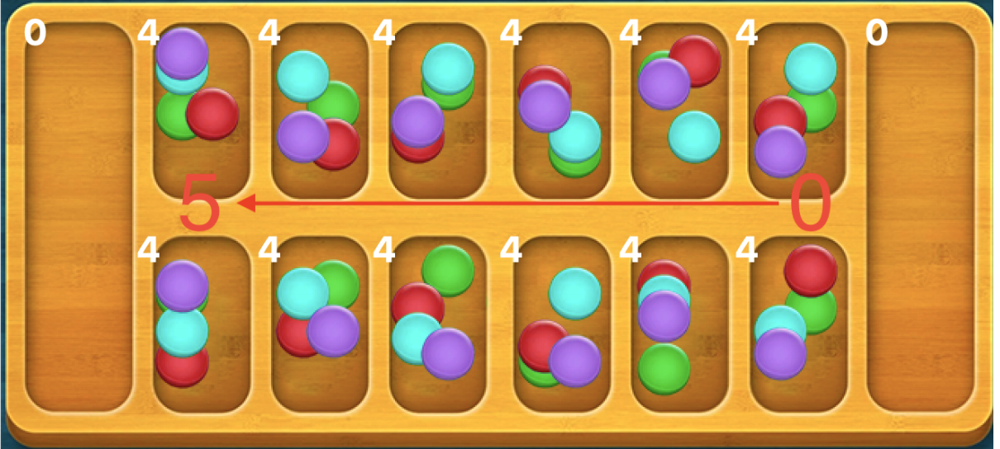

# Mancala

Mancala game and AIs.

This repository was contributed by：

1. @HarmoniaLeo
2. @fyqqyf
3. @WhereHvaeAllTheFlowerGone

Please run `train_mancala_agent.py` first to get `model/mancala_agent.pkl` for RL AI. 

Running `main.py` to start the game. 

- [Mancala](#mancala)
  - [Background](#background)
  - [Modeling](#modeling)
  - [Reinforcement Learning](#reinforcement-learning)
  - [Adversarial Search Minimax](#adversarial-search-minimax)
    - [Algorithm Background](#algorithm-background)
    - [$\alpha-\beta$ pruning](#alpha-beta-pruning)
    - [Expectimax](#expectimax)
  - [Analysis of results and future works](#analysis-of-results-and-future-works)
    - [Analysis of results](#analysis-of-results)
      - [Minimax](#minimax)
      - [Reinforcement Learing](#reinforcement-learing)
  - [Future works](#future-works)

## Background

Mancala, or African chess, is a game played by two people. It is characterized by the continuous moving of gems into the plate like sowing and is widely popular in African countries. Mancala consists of 14 plates, two of which are scoring plates and the other 12 are non-scoring plates allocated to two players. At the beginning of the game, four gems were placed on each of the 12 non-scoring plates. The player moves by selecting one of the six non-scoring plates containing gems. All gems in the selected plate are picked up, and then each gem is placed in the next plate at one time, moving in a counterclockwise direction. You can place a gem in twelve non-scoring plates and the current player's scoring plates. The opponent's scoring plate will be skipped. Alternating games between players. When a player scores 25 points or more, the game ends. 
There is an additional rule. If two conditions are met at the same time, a capture rule will occur: the last gem dropped by the player falls in the empty plate on the side of the current player, and there is at least one gem in the opponent's plate opposite the empty plate. In this case, the current player will capture the last gem placed and all the gems on the opponent's plate.


The following figure is our simulation interface for Mancala:


Click `start a game using P1 or P2` to play chess with the AI set by the other side. Move by **clicking the number in the upper left corner** of the non-scoring plate on the picture.
Click `AIs against each other` to let the two AI players play chess.

In this project, we implemented the simulation of Mancala and used a variety of algorithms to determine the next strategy, which are:

* Random
* Minimax & alpha beta pruning
* Reinforcement Learning

## Modeling

To model the Mancala game world, we make the following agreements:
1. Let the scoreboard on the right side be player1, and the scoring plate on the left side be player2. 

   

2. Plate number:
   1. When representing states, the scoring plates are included, numbered counterclockwise from the bottom left, and numbered as 0-13 in sequence. 

      

   2. In the turn of player 1, select the non-scoring plate. When moving the gems, the non-scoring plates will be numbered as 0-5 from the bottom left to the bottom right. 

      

   3. In the turn of player 2, select the non-scoring plate. When moving the gems, the non-scoring plates will be numbered as 0-5 from the top right to the top left. 

      

In this way, we can use the following attributes to represent the states:

* Number of gems in 14 plates

* Which side is going to move now

The status is represented by 15 bytes, and the first 14 bits represent the number of gems on each plate; When the last bit is true, it indicates the round of player1; when the last bit is false, it indicates the round of player2. 

A number of 0-5 can be used to indicate the tray selected by the player, that is, the action in each state. 

The whole game can be modeled as an information complete search process, which is divided into the following parts:

1. Initial state: (4,4,4,4,4,4,0,4,4,4,4,0, true), indicating that 12 non-scoring plates each have 4 gems, and two scoring plates do not have any gem. In the beginning, player1 acts. 

   ```python
   #In world.py
   startState=(4,4,4,4,4,4,0,4,4,4,4,4,4,0,True)
   ```

2. Legal actions collection $Actions(S)$: A list, each bit is a number of 0-5. Only non-scoring plates with gems greater than 0 can be selected. 

   ```python
   #In world.py
   def getLegalActions(state): #Given state, return a list of legal actions (taking values from 0-5)
       actions=[] 
       if state[-1]==True: 
           for i in range(0,6): 
               if state[i]>0: 
                   actions.append(i) 
       else:
           for i in range(7,13): 
               if state[i]>0: 
                   actions.append(i-7) 
       return actions
   ```

3. State transfer function $Result(S,A),A\in Actions(S)$ : rule-compliant state transfer function, including changes in the number of gems in each disk, alternation of actors, and rules such as capture. 

   ```python
   #In world.py
   def transition(state,action): #state: enter a 15-bit tuple state (e.g. (0,0,0,0,0,0,0,24,0,0,0,0,0,0,0,0,24,True)), indicating that the number of gems in each of the 12 non-scoring plates are 0, the two scoring plates have 24 balls each, and it is player1's turn to act 
       #action: a value from 0-5. player1's turn is 0-5 from bottom left to bottom right; player2's turn is 0-5 from top right to top left
       newstate=list(state) 
       newstate[-1]=not newstate[-1] 
       if state[-1]: 
           point=action+1 
           times=state[action] 
           newstate[action]=0 
           for i in range(times): 
               if (i==times-1) and (newstate[point]==0) and (point<6) and (newstate[12-point]>0): 									newstate[6]+=1+newstate[12-point] 
               	newstate[12-point]=0 
                   break 
              	newstate[point]+=1 
               point+=1 
               if point==14: 
                   point=0 
       else:
           point=action+8 
           times=state[action+7] 
           newstate[action+7]=0 
           for i in range(times): 
               if (i==times-1) and (newstate[point]==0) and (point>6) and (newstate[12-point]>0):
                   newstate[13]+=1+newstate[12-point] 
                   newstate[12-point]=0 
                   break 
               newstate[point]+=1 
               point+=1 
               if point==14: 
                   point=0 
   	return tuple(newstate)	#newstate is the new state
   ```

4. End state : The game ends when all the gems in the non-scoreboard of one player are 0

   ```python
   #In world.py
   def isTerminal(state): #Given state, determine if it is a terminated state
       if (np.sum(state[:6])==0) or (np.sum(state[7:13])==0): 
           return True 
       return False
   ```

5. Judging the winner in the end state $Judge(S_f)$: the player with the most gems in their respective plates wins. 

   ```python
   #In world.py
   def getSum(state): #Returns the sum of all gems on player1's side and the sum of all gems on player2's side, which is used to determine the winner
       return np.sum(state[:7]),np.sum(state[7:-1])
   ```

## Reinforcement Learning

Using the **Q-Learning** algorithm and using the time difference method **(TD)**

Each parameter is initialized as follows: 

```python
#In agent.py
def __init__(self, alpha=0.5, gamma=0.9, epsilon=0.4, max_actions=6, load_agent_path=None): 
    try:
        with open(load_agent_path, 'rb') as infile: 
            self.statemap = pickle.load(infile) 
        except FileNotFoundError: 
            print("No pretrained agent exists. Creating new agent") 
            self.statemap = {} 
   	# Parameters not saved in pkl file 
    self.max_actions = max_actions 
    self.previous_state = 0 
    self.previous_action = 0 
    self.alpha = alpha 
    self.gamma = gamma 
    self.epsilon = epsilon
```

* epsilon: randomly selects the action with a certain probability, instead of selecting the action based on MAX{Q}. The algorithm then reduces this random probability as it continues to learn using a decay function. This triggers random exploration and exposure to more states, thus finding a tradeoff between "exploration" and "exploiting".  Here, 0.8 is chosen. 
* alpha: a quantity used to weigh the last learned result and the current one, e.g., $Q=(1-\alpha)Q_{old}+\alpha Q_{current}$. alpha set too low will cause the agent to only care about the previous knowledge and not accumulate new rewards. 0.5 is taken here to balance the previous knowledge and new rewards. 
* gamma: factor to consider future rewards, is a value between (0,1). It is usually taken as 0.9, which enables to adequately consider the external rewards. 

Starting game by initializing state **S**

```python
#In mancala.py
self.pockets = [4,4,4,4,4,4,0,4,4,4,4,4,4,0,True] #State initialization
```

The **epsilon-greedy** algorithm is used to select the action **A** and obtain the state **S',** i.e., the next state, in the state of action **A**. epsilon-greedy algorithm is a greedy algorithm that, unlike selecting only the optimal action, in each selection process, will with a small probability choosing other actions that are not the optimal action, thus enabling continuous exploration. 

```python
#In agent.py
def take_action(self, current_state): 
    # Random action 1-epsilon percent of the time 
    if random.random()>self.epsilon: 
        action = random.randint(0,5) 
    else:
        # Greedy action taking 
        hashed_current_state = hash(''.join(map(str, current_state))) 
        current_q_set = self.statemap.get(hashed_current_state) 
        if current_q_set is None: 
            self.statemap[hashed_current_state] = [0]*self.max_actions 
            current_q_set = [0]*self.max_actions 
        action = current_q_set.index(max(current_q_set)) # Argmax of Q 
    self.previous_action = action 
    return converted_action
```

Update future rewards for **s** using feedback rewards for **s** and future rewards for **s'**: $Q^*(s_t,a_t)\leftarrow R(s_t,a_t)+\gamma\displaystyle\max_{a\in A}Q^*(s_{t+1},a)$

```python
#In agent.py
def update_q(self, current_state, reward=0): 
    # Assume no reward unless explicitly specified 
    # Convert state to a unique identifier 
    hashed_current_state = hash(''.join(map(str, current_state))) 
    hashed_previous_state = hash(''.join(map(str, self.previous_state))) 
    current_q_set = self.statemap.get(hashed_current_state) 
    previous_q_set = self.statemap.get(hashed_previous_state)
    # Add new dictionary key/value pairs for new states seen 
    if current_q_set is None: 
        self.statemap[hashed_current_state] = [0]*self.max_actions 
        current_q_set = [0]*self.max_actions 
    if previous_q_set is None: 
        self.statemap[hashed_previous_state] = [0]*self.max_actions 
    # Q update formula 
    q_s_a = self.statemap[hashed_previous_state][self.previous_action] 
    q_s_a = q_s_a + self.alpha*(reward+self.gamma*max(current_q_set)-q_s_a) # Update Q 	
    self.statemap[hashed_previous_state][self.previous_action] = q_s_a 
    # Track previous state for r=delayed reward assignment problem 
    self.previous_state = current_state 
    return True 
```

## Adversarial Search Minimax

### Algorithm Background

The Minimax algorithm contains three important parts - the max layer, the min layer, and the valuation function.

The Minimax algorithm assumes that both sides of the game are perfectly rational, i.e., both Agents choose the most beneficial action. minimax divides the game tree into maximal and minimal layers, maximizes the benefits of the maximal layer and minimizes the benefits of the minimal layer when it is the turn of different players to act, and then returns the most beneficial action.


The maximal layer corresponds to the layer in which the Agent's turn to move is coming, and the node value is its maximum child node value, which means that the Agent will choose the direction of action that gives the highest gain. The min layer alternates with the max layer, and its node value is its smallest child node value, indicating that the Agent's opponent will choose the direction that makes the Agent act with the least gain.

```python
#In minimaxAgent.py
#The maximal layer returns the maximum value in the child nodes
def maxValue(self,state,ply,turn): 
    if ply==0: 
        return turn.score(state) 
    score_max=-999 
    for move in getLegalActions(state): 
        next_state=transition(state,move) 
        s=self.minValue(next_state,ply-1,turn) 
        if s>score_max: 
            score_max=s 
   	return score_max 
#The minimal layer returns the smallest values in the child nodes
def minValue(self,state,ply,turn): 
    if ply==0: 
        return turn.score(state) 
    score_min=999 
    for move in getLegalActions(state): 
        next_state=transition(state,move) 
        s=self.maxValue(next_state,ply-1,turn) 
        if s<score_min: 
            score_min=s 
    return score_min
```

* ply is the remaining required exploration depth. ply > 0 indicates that the node is not a leaf node

The Minimax algorithm uses a valuation function to assign a value to a leaf node by the state it is in because it has no children. The closer the valuation function is to the true value, the better the Minimax algorithm works.

```python
#In minimaxAgent.py
if ply==0: 
    return turn.score(state)
```

In the Mancala game, we divide the game phases into the early phase and the final phase. We call the early phase when the total number of gems on both sides' scoring plate is less than 30. In this phase, the Agent's goal is to widen the gap between the number of gems in his opponent's scoring plate as much as possible, so the valuation function can be chosen as the difference between the number of gems in the Agent's and his opponent's scoring plate.

```python
#In minimaxAgent.py
p1_bag=state[6] 
p2_bag=state[13] 
if p1_bag+p2_bag<30: 
    if state[-1]==True: 
        return (p1_bag-p2_bag) 
    else:
        return -(p1_bag - p2_bag)
```

At the end of the game, the gems belonging to the non-scoring plates of each side are added to the scoring plates and the total score is calculated. In addition, the more empty non-scoring plates there are, the closer the game is to the end, so if the Agent is in an advantageous position, he needs to end the game quickly, and if he is in a disadvantageous position, he needs to avoid ending the game. Therefore, the valuation function should consider the product of the sum of the number of gems in each party's scoring and non-scoring plates and the total number of empty plates.

```python
#In minimaxAgent.py
grid_empty = sum(np.array(state[:-1]) == 0) 
polar=0 
if p1_sum<p2_sum: 
    polar=-1 
else:
    polar=1 
if p1_bag+p2_bag<30: 
    if state[-1]==True: 
        return (p1_bag-p2_bag) 
    else:
        return -(p1_bag - p2_bag) 
else:
    if p1_sum-p2_sum==0: 
        return 0 
    if state[-1]==True: 
        return (p1_sum-p2_sum)*(1+polar*grid_empty*1.0/fabs(p1_sum-p2_sum)) 
    else:
        return -(p1_sum-p2_sum)*(1+polar*grid_empty*1.0/fabs(p1_sum-p2_sum))
```

The time complexity of Minimax is O(b^m), which means that the time cost grows exponentially with the exploration depth. For complex games, Minimax cannot be explored too deeply. In the Mancala game, the number of Minimax layers is chosen to be 5. 

### $\alpha-\beta$ pruning

Alpha-beta pruning solves the problem that Minimax cannot explore too deeply by reducing the number of branches searched during the traversal of the tree. Branch evaluation is dropped if the agent realizes that the path cannot be executed better than the previously observed choice. By traversing, two variables will be stored: α (the maximum score guaranteed by the player for the branch) and β (the minimum score guaranteed by the opponent). During the maximization level traversal, if the node does not increase alpha, the branch will be pruned. Conversely, during the minimization level, if the node does not increase beta, the branch will be pruned.


For our chosen depth, the observed performance can be improved by an order of magnitude. After α-β pruning, the time complexity of the algorithm is $o(b^{\frac{m}{2}})$. In the Mancala game, the number of Minimax layers selected after α-β pruning is 8.

### Expectimax

Minimax can make optimal choices in the face of optimal adversaries, however, Minimax has a natural constraint in some cases, where the adversary does not necessarily make optimal actions, and the Minimax minimalist layer makes errors in judgment, so the Agent's actions may cause misjudgments. Expectimax assigns values to the nodes as follows.


* $p(s'|s)$ denotes the probability of moving from state $s$ to $s'$ in the case of an undetermined operation

Expectimax uses probability to reflect the game state, and it can be seen in the later experimental results, Expectimax may be significantly more effective than Minimax in the face of a randomly acting opponent.


## Analysis of results and future works

### Analysis of results

| Player1\Player2            | Random | Minimax | Reinforcement Learning | Expectimax |
| -------------------------- | ------ | ------- | ---------------------- | ---------- |
| **Random**                 | 51     | 58      | 54                     | 80         |
| **Minimax**                | 40     | 50      | 47                     | 60         |
| **Reinforcement Learning** | 37     | 53      | 49                     | 73         |
| **Expectimax**             | 20     | 40      | 30                     | 100        |

The table above shows the number of victories of player1 against player2 in 100 experiments. From the results it is clear that Expectimax is the most effective and Reinforcement is the least effective. It is worth noting that when both players are Expectimax, the first player (player1) will win 100% of the time.

#### Minimax

| Number of Minimax layers ($\alpha-\beta$ pruning) | Number of victories | Number of draws | Minimax win rate | Time spent | Average running time |
| ------------------------------------------------- | ------------------- | --------------- | ---------------- | ---------- | -------------------- |
| 2                                                 | 577                 | 33              | 59.67%           | 10.7632    | 0.019763             |
| 3                                                 | 577                 | 29              | 59.42%           | 27.1643    | 0.027164             |
| 4                                                 | 570                 | 32              | 58.88%           | 92.1430    | 0.092143             |
| 5                                                 | 563                 | 32              | 58.16%           | 156.254    | 0.156254             |

| Expectimax layers | Number of victories | Number of draws | Minimax win rate | Time spent | Average running time |
| ----------------- | ------------------- | --------------- | ---------------- | ---------- | -------------------- |
| 2                 | 773                 | 33              | 79.12%           | 17.6209    | 0.017620             |
| 3                 | 480                 | 5               | 48.24%           | 93.0621    | 0.093062             |
| 4                 | 766                 | 23              | 78.40%           | 317.9181   | 0.317918             |
| 5                 | 510                 | 2               | 51.10%           | 1957.7808  | 1.957780             |

As can be seen, the win rate of Minimax versus Random Agent is in the range of 58-59%, while the win rate of Expectimax varies significantly with the depth of exploration. The win rate is around 50% when the depth is odd and around 80% when the depth is even. The conjecture is that when the depth is odd, the game tree is directly connected to the leaf nodes in the minimal layer, i.e., the layer of Random Agent. Since the Random Agent's action is completely random, it will misinterpret the first valuation passed by the leaf node, so its ancestor node's judgment is seriously disturbed. When the depth is even, the leaf node is the very small layer, and directly connected to it is the very large layer, i.e., the layer where the Minimax Agent acts. At this time, Minimax must choose the node with the highest valuation action, which will extract the first valuation information better, and its ancestor nodes is less affected.

In addition, it is easy to find that the running time per game increases exponentially as the number of layers increases, and the time required for the same number of layers Expectimax is substantially larger than the time required for Minimax after α-β pruning.

#### Reinforcement Learing

The approximate number of possible states for Mancala is capped at 12⁴⁸ (12 plates, 48 available gems) ≈ 10⁵⁰, so there are too many states for the agent to explore. Therefore, the algorithm does not work well in this experiment. 

## Future works

There are the following perspectives in the future works. 

- State/action tables can be eliminated using deep reinforcement learning as an agent, using q-learning and a deep neural network to represent the estimated q-values. At this point, the original state & win/loss is analyzed using a convolutional neural network (CNN) as the state input. Input to the CNN as a 6x2 grayscale image for training.
- Training can be combined with Minimax to reduce the state search space.
